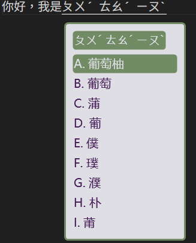
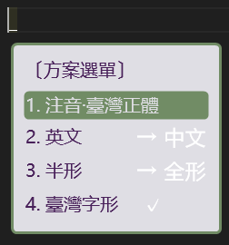
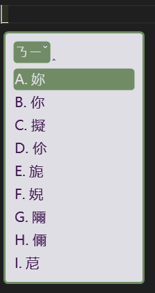
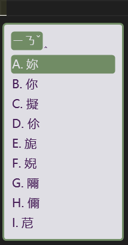

# Poyu39 RIME Custom

> [RIME | 中州韻輸入法引擎](https://rime.im/)

## 特色

使用 `.custom.yaml` 覆蓋 `bopomofo_tw`，避免更新覆蓋設定檔。

### 外觀
  - 自定義葡萄柚顏色主題
  - 「方案選單」極簡化，只保留臺灣字形。

### 功能
- 關閉 `左 Shift ` 切換中英文功能，只使用 `右 Shift ` 切換中英文功能。
- 關閉反查
- 只使用 `ctrl+grove` 開啟方案選單
- 允許聲母/介音順序互換

## 允許聲母/介音順序互換

Why: 注音使用者容易將聲母和介音順序顛倒，例如輸入「ㄋㄧˇ」時，可能會輸入成「ㄧㄋˇ」，這時候兩者都能正確輸出「你」。

